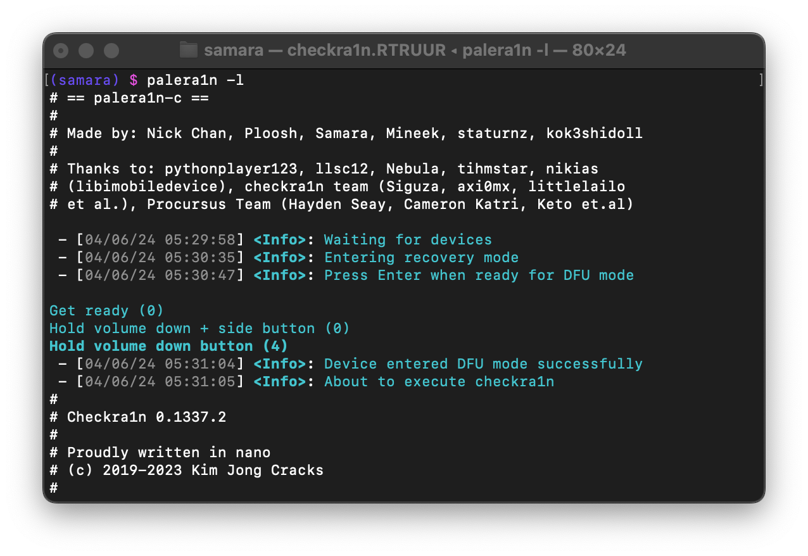

# palera1n

Jailbreak for A8 through A11, T2 devices, on iOS/iPadOS/tvOS 15.0, bridgeOS 5.0 and higher.

| 	| 
|:--:												| 
| A screenshot of palera1n being used in a Terminal | 

## Device Support

> [!NOTE]  
> Apple TV & iBridge support are not currently in the beta releases of palera1n, ETA s0n

<!--- Mobile --->

| iPhone(s)                 | iPad(s)                        		| iPod(s)   					| Apple TV(s) 					|
|-							|-										|-								|-								|
| iPhone 6s                 | iPad mini 4							| iPod Touch (7th generation)	| Apple TV HD                 	|
| iPhone 6s Plus            | iPad (5th generation)					|								| Apple TV 4K (1st generation)	|
| iPhone SE (2016)          | iPad (6th generation)					|								|								|
| iPhone 7                  | iPad (7th generation)					|								|								|
| iPhone 7 Plus             | iPad Pro (9.7")						|								|								|
| iPhone 8                  | iPad Pro (12.9") (1st generation)		|								|								|
| iPhone 8 Plus             | iPad Pro (10.5")						|								|								|
| iPhone X                  | iPad Pro (12.9") (2nd generation)		|								|								|
|                           | iPad Air 2		|								|								|

> Note that on `A11` (iPhone X, 8, 8 Plus), **you must disable your passcode while in the jailbroken state** (on iOS 16, you need to **reset your device** before proceeding with palera1n).

<!--- T2 --->

Apple T2 Device Support (click to expand)

| Apple T2              	|
|-							|
| Apple T2 iMac20,1         |
| Apple T2 iMac20,2         |
| 			              	|
| Apple T2 MacBookAir8,1    |
| Apple T2 MacBookAir8,2    |
| Apple T2 MacBookAir9,1    |
| 			              	|
| Apple T2 MacBookPro15,1   |
| Apple T2 MacBookPro15,2   |
| Apple T2 MacBookPro15,3   |
| Apple T2 MacBookPro15,4   |
| Apple T2 MacBookPro16,1   |
| Apple T2 MacBookPro16,2   |
| Apple T2 MacBookPro16,3   |
| Apple T2 MacBookPro16,4   |
| 			              	|
| Apple T2 iMacPro1,1       |
| Apple T2 Macmini8,1       |
| Apple T2 MacPro7,1        |
|			              	|
| iBridge2,11 (Unknown Mac) |
| iBridge2,13 (Unknown Mac) |

## Computer Requirements
1. **USB-A** cables are recommended to use, USB-C to may have issues with palera1n and getting into DFU mode.
> Due to USB-C cables having different accessory IDs, your device may not be able to be recognized when using USB-C due to not being able to assert to its USB voltage pin.

2. **Linux or macOS computer**
> AMD CPUs (not AMD Mobile) have an issue where it causes them to have a very low success rate with checkm8 exploit. It is not recommended that you use them with palera1n.

> USB-C port on Apple Silicon Macs *may* require manual unplugging and replugging of the lightning cable after checkm8 exploit. This problem may be solved by connecting via USB hub, though extensions can vary.

## Installing
Visit https://palera.in

## Disclaimers
We are **NOT** responsible for any data loss, or the result of a device being bricked. When using palera1n, the user should accept responsibility if anything happens to their device during the process.
- If your device is stuck in recovery, please run futurerestore `--exit-recovery`, or use `irecovery -n`.
- If you're unable to get out of recovery via these methods please restore with iTunes or Finder.
- palera1n **will not work** in VirtualBox, VMware or any virtual machine that doesn't support PCI passthrough.

## Troubleshooting
Make sure you're following the guides provided [here](https://palera.in), also when asking for support make sure you provide full details on your device, such as:
- iPhone/iPad/iPod/Apple TV
- iOS Version
- Passcode enabled?
- Verbose from palera1n (specifying `-Vv` within palera1n)
- Panic logs, if panicked then send latest `panic-full` log from your device.

Create an issue here: https://github.com/palera1n/palera1n/issues/new/choose
